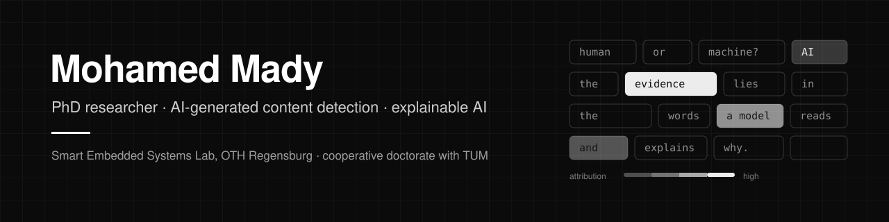

  

  
  
  
  
  
  

### About

I am a PhD researcher at the [Smart Embedded Systems Lab](https://github.com/SES-Lab-OTH) of OTH Regensburg, in a cooperative doctorate with the Technical University of Munich, supervised by Prof. Johannes Reschke and Prof. Björn W. Schuller. I build detectors for AI-generated text and images that hold up outside the lab: across datasets, generators and domains, under adversarial manipulation of their input, and with decisions that can be explained to the people who rely on them.

### Featured

<table>
<tr>
<td width="50%" valign="top">

**[DeBERTa-ConPara](https://github.com/SES-Lab-OTH/deberta-conpara)** 
AACL-IJCNLP 2026, main conference

Attack-aware, deployment-realistic detection of AI-generated text. Official RAID leaderboard: **AUROC 99.61 %**, **TPR 96.57 %** at 1 % FPR. Normalising Unicode at inference lifts homoglyph and zero-width-space attacks from 11.05 % and 1.12 % to 96.98 % TPR.

[Paper](https://arxiv.org/abs/2610.00883) · [Code](https://github.com/SES-Lab-OTH/deberta-conpara) · [Model](https://huggingface.co/SES-Lab-OTH/deberta-conpara) · [Live demo](https://huggingface.co/spaces/mohamedmady/deberta-conpara) · [DOI](https://doi.org/10.5281/zenodo.23198565)

</td>
<td width="50%" valign="top">

**Datasets** 
on the lab's Hugging Face

[Academic-Text-arxiv-gpt-gemini](https://huggingface.co/datasets/SES-Lab-OTH/Academic-Text-arxiv-gpt-gemini): 669,008 academic paragraphs, human (arXiv, before 2022) and AI-generated (GPT-3.5-Turbo, Gemini 2.0 Flash).

[HC3-Gemini-Flash-Responses](https://huggingface.co/datasets/SES-Lab-OTH/HC3-Gemini-Flash-Responses): 23,463 Gemini 2.0 Flash answers to the HC3 questions, for measuring generator shift.

**Now:** what do AI-text detectors actually look at? Faithfulness and ground-truth evaluation of their explanations.

</td>
</tr>
</table>

### Publications

- **DeBERTa-ConPara: Attack-Aware and Deployment-Realistic Detection of AI-Generated Text.** M. Mady, Y. Li, J. Reschke, B. W. Schuller. *AACL-IJCNLP 2026.* [arXiv](https://arxiv.org/abs/2610.00883) · [code](https://github.com/SES-Lab-OTH/deberta-conpara)
- **Beyond Accuracy: ARIA-Rubrics for Evaluating Audio Reasoning in Large Audio Language Models.** Y. Li, Q. Sun, M. Mady, C. Wang, Z. Gong, B. Sisman, B. W. Schuller. *Findings of AACL-IJCNLP 2026.* [arXiv](https://arxiv.org/abs/2609.09681)
- **AI-Generated Content Detection: A Cross-Modal Survey of Methods, Challenges, and Future Directions.** M. Mady, Y. Li, B. W. Schuller, B. Sisman, J. Reschke. *Preprint, 2026.* [Research Square](https://www.researchsquare.com/article/rs-10864156/v1)
- **Feature-Augmented Transformers for Robust AI-Text Detection Across Domains and Generators.** M. Mady, J. Reschke, B. W. Schuller. *arXiv, 2026.* [arXiv](https://arxiv.org/abs/2605.03969)

### Before research

- **ficonTEC Service GmbH**: production automation for photonics and semiconductor assembly (FAU-to-PIC alignment, laser soldering, wafer probers, SECS/GEM).
- **BMW Group**: prediction of road-induced vibration (95 %+ accuracy), about 30 % fewer physical prototype tests.
- **Boehringer Ingelheim**: automated real-world-evidence pipelines and R Shiny dashboards, 40 % faster clinical data processing.

### Education

- **Ph.D. candidate**, AI-generated content detection, TUM and OTH Regensburg
- **M.Eng.** AI for Smart Sensors and Actuators, Technische Hochschule Deggendorf, 2024
- **B.Eng.** Electronics and Communications, Mansoura University, 2022

### Tools

`Python` `PyTorch` `Hugging Face Transformers` `scikit-learn` `Integrated Gradients` `SHAP` `LIME` `Grad-CAM` `OpenCV` `Docker` `FastAPI` `R`

### Contact

mohamed.mady@tum.de · mohamed.mady@st.oth-regensburg.de · Mohamed.Mady@gmx.de · [LinkedIn](https://www.linkedin.com/in/mohamedmady19/) · [Google Scholar](https://scholar.google.com/citations?user=eeCPjoIAAAAJ) · [ORCID](https://orcid.org/0009-0007-8599-2174)
